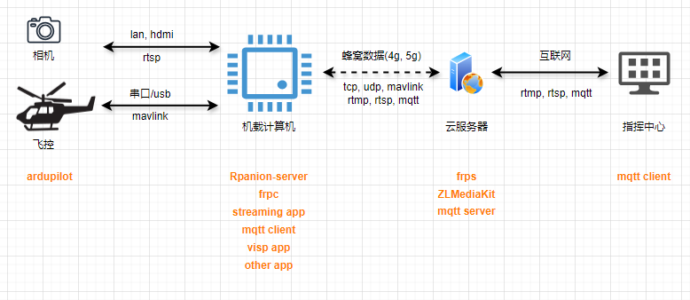

## 使用文档
在公网服务器搭建mqtt服务，飞机的机载计算机使用mavsdk获取到飞控数据，然后解析数据并封装成mqtt消息格式，最后使用mqtt客户端发布封装后的数据到mqtt服务器。
mqtt客户端sdk使用 Paho MQTT C Client Library。
主要逻辑代码：mqtt_client.cpp

# 编译
cmake .
make

# 前提条件
编译并安装paho.mqtt.c库
git clone https://github.com/eclipse/paho.mqtt.c.git
cd org.eclipse.paho.mqtt.c.git
make
sudo make install
默认安装位置：
usr/local/include/
usr/local/lib/

